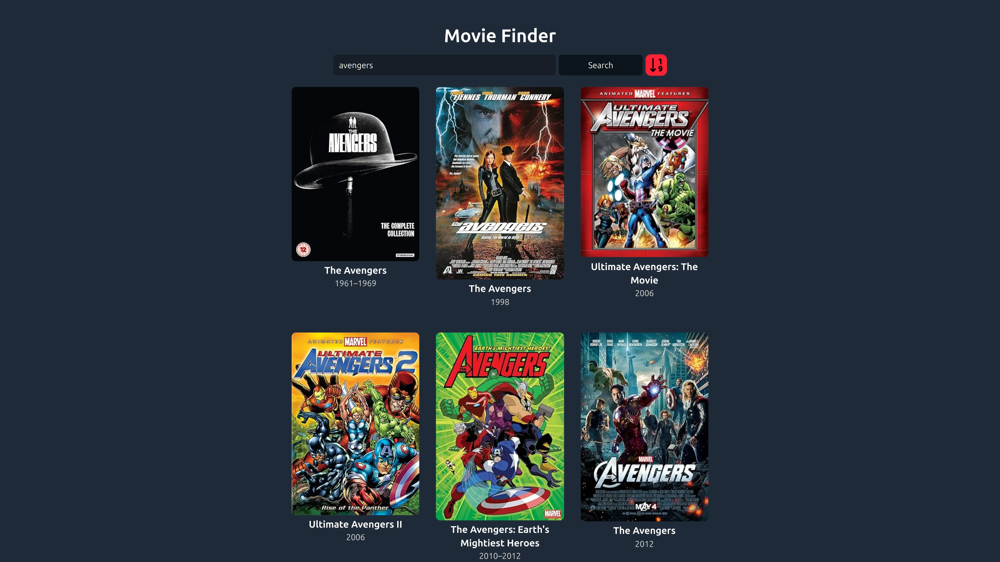
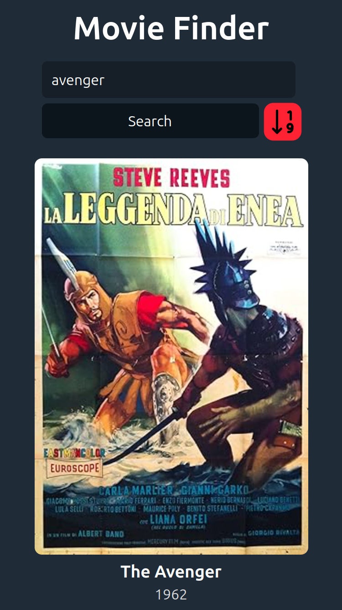

<a id="top"></a>

<h1 align="center"> Movie Finder</h1>


<p align="center">
  <a href="#">
    
  </a>
  <a href="https://opensource.org/licenses/MIT" target="_blank">
    
  </a>
</p>

<div align="center">
    <a href="#-about" target="_blank">
        About
    </a>
    <span>&nbsp;✦&nbsp;</span>
    <a href="#-preview" target="_blank">
        Preview
    </a>
    <span>&nbsp;✦&nbsp;</span>
    <a href="#-features" target="_blank">
        Features
    </a>
    <span>&nbsp;✦&nbsp;</span>
    <a href="#-stack" target="_blank">
        Stack
    </a>
    <span>&nbsp;✦&nbsp;</span>
    <a href="#-getting-starter" target="_blank">
        Getting Started
    </a>
    <span>&nbsp;✦&nbsp;</span>
    <a href="#-commands" target="_blank">
        Commands
    </a>
    <span>&nbsp;✦&nbsp;</span>
    <a href="#-contributions" target="_blank">
        Contributions
    </a>
    <span>&nbsp;✦&nbsp;</span>
    <a href="#-license" target="_blank">
        License
    </a>
    <span>&nbsp;✦&nbsp;</span>
    <a href="#-support" target="_blank">
        Support
    </a>
</div>
<br>

>If you want to read this readme in **Spanish**
>- [**Spanish README**](https://github.com/joserafael0160/Movie-Finder/blob/main/README.es.md)

## 📜 About 
Welcome to my movie search engine! With this tool, you can explore and search for your favorite films. 

Filter by release year and discover new cinematic gems. 

Enjoy the magic of cinema! 🎥🍿

<p align="right">(<a href="#top" >Go Back To Top 🔝</a>)</p>

## 👀 Preview
<h4>In a PC (1920x1080)</h4>


<h4>In a iPhone SE (375x667)</h4>


<p align="right">(<a href="#top">Go Back To Top 🔝</a>)</p>


## 💬 Features
- **Favicon Support**: Support for a wide range of favicon sizes has been added, ensuring that the site’s icon displays correctly on all devices and platforms.
- **Open Graph and Twitter Tags**: Open Graph and Twitter meta tags have been included, which optimize the preview of the website on social platforms like Facebook and Twitter.
- **Cross-Browser Compatibility**: The web page uses the `X-UA-Compatible` meta tag, which helps ensure compatibility with multiple browsers, especially older versions of Internet Explorer.
- **Movie API (OMDb)**: I used the OMDb (Open Movie Database) API to retrieve movie information.
- **Grid Responsive**: In this application, the movies will be displayed in rows and columns, adjusting to look good on both large screens and mobile devices.
- **Avoiding Duplicate Searches**: I've implemented logic to prevent the same search from being performed twice in a row. This improves efficiency and the user experience.
- **Automatic Search While Typing**: When the user types in the search field, the application automatically performs a search against the OMDb API without requiring an additional button click. This provides a quicker and smoother response for the user.
- **Avoiding Continuous Searches While Typing (Debounce)**: Debounce is a technique that delays the execution of a function (in this case, the search) until the user has stopped typing for a brief period (300 ms). This prevents continuous searches while the user is still typing, which could overload the API or impact application performance.
  
<p align="right">(<a href="#top">Go Back To Top 🔝</a>)</p>

## 🧰 Stack
- [**React**](https://reactjs.org/) - A JavaScript library for building interactive user interfaces.
- [**Vite**](https://vitejs.dev/) - A fast and lightweight development environment for modern web applications.
- [**ESLint**](https://eslint.org/) - An open-source tool that helps you find and fix problems in your JavaScript code.


<p align="right">(<a href="#top">Go Back To Top 🔝</a>)</p>


## 🚀 Getting Starter
1. **Fork** or clone this repository

```bash
git clone git@github.com:joserafael0160/Movie-Finder.git
```

2. Install the dependencies: 

- I used [**bun**](https://bun.sh) to install and manage the dependencies.
  
```bash
# Install bun for MacOS, WSL & Linux:
curl -fsSL https://bun.sh/install | bash

# Install bun for Windows:
powershell -c "iwr bun.sh/install.ps1|iex"

# Install with bun:
bun install
```

- or you can use [**pnpm**](https://pnpm.io):

```bash
# Install pnpm globally if you don't have it:
npm install -g pnpm

# Install dependencies:
pnpm install
```

1. Run the development server:

```bash
# Run with bun:
bun run dev

# Run with pnpm:
pnpm run dev
```

<p align="right">(<a href="#top">Go Back To Top 🔝</a>)</p>

## 🧞 Commands
|      | Command   | Action                                         |
| :--- | :-------- | :-------------------------------------------- |
| ⚙️    | `dev`     | Starts the local development server.           |
| ⚙️    | `build`   | Builds the production version to `./dist/`.    |
| ⚙️    | `lint`    | Runs ESLint to find issues in your JavaScript code. |
| ⚙️    | `preview` | Previews the local build.                      |
| ⚙️    | `predeploy` | Generates the production version before deploying. |
| ⚙️    | `deploy`  | Deploys the site to GitHub Pages from the `dist` folder. |


<p align="right">(<a href="#top">Go Back To Top 🔝</a>)</p>


## 🤝 Contributions

Contributions are always welcome! Whether you’re reporting bugs, requesting new features, or improving existing functionalities, your help is **greatly appreciated**.

If you have any suggestions that could improve the project, please make a [_fork_](https://github.com/joserafael0160/Movie-Finder/fork) of the repository and create a [_pull request_](https://github.com/joserafael0160/Movie-Finder/pulls). You can also simply open an [_issue_](https://github.com/joserafael0160/Movie-Finder/issues) with the “enhancement” label.

Here is a quick guide:

1. Make a [_fork_](https://github.com/joserafael0160/Movie-Finder/fork) of the Project
2. Clone your [_fork_](https://github.com/joserafael0160/Movie-Finder/fork) (`git clone <URL of the fork>`)
3. Add the original repository as remote (`git remote add upstream <URL of the original repository>`)
4. Create your Feature Branch (`git switch -c feature/NewFeature`)
5. Make your Changes (`git commit -m 'Add: some NewFeature'`)
6. Push to the Branch (`git push origin feature/NewFeature`)
7. Open a [_pull request_](https://github.com/joserafael0160/Movie-Finder/pulls)

<p align="right">(<a href="#top">Go Back To Top 🔝</a>)</p>

## 🔑 License
[MIT](https://github.com/joserafael0160/Movie-Finder/blob/main/LICENSE)

<p align="right">(<a href="#top">Go Back To Top 🔝</a>)</p>

## 🙏 Support
Don't forget to leave a star ⭐️

<p align="right">(<a href="#top">Go Back To Top 🔝</a>)</p>

<br>
<hr>
<p align="center">✌️</p>
<p align="center">
<sub><sup>A project created by <a href="https://github.com/joserafael0160">@joserafael0160</a></sup></sub>